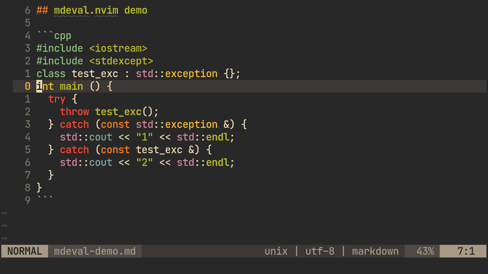

# mdeval.nvim

This plugin allows you evaluate code blocks inside markdown, [vimwiki](https://github.com/vimwiki/vimwiki) and [norg](https://github.com/vhyrro/neorg) documents.

It attempts to implement the basic functionality of org-mode's [evaluating code blocks](https://orgmode.org/manual/Evaluating-Code-Blocks.html#Evaluating-Code-Blocks) feature inside Neovim.

## Demo



## Requirements
This plugin requires Neovim version 0.5+.

It works on Linux, MacOS and Windows (through WSL).

MacOS users should make sure that they have `coreutils` package installed:

```bash
brew install coreutils
```

Windows users should have [installed WSL](https://docs.microsoft.com/en-us/windows/wsl/install-win10) with compilers/interpreters they want use.

## Installation

Install it with your plugin manager.

Then add the following line in your `init.lua`:

```lua
require 'mdeval'.setup()
```

You should also enable syntax highlighting inside code blocks for your languages using the built-in functionality:

```lua
vim.g.markdown_fenced_languages = {'python', 'cpp'}
```

## Usage

To use this plugin, you should move cursor inside a fenced code block with language identifier and execute the `:MdEval` command.
*mdeval.nvim* will capture the results of the code block execution and inserts them in the markdown file, right after the code block.

## Configuration

You can configure *mdeval.nvim* by running the `mdeval.setup` function.

Here is an example:

```lua
require 'mdeval'.setup({
  -- Don't ask before executing code blocks
  require_confirmation=false,
  -- Change code blocks evaluation options.
  eval_options = {
    -- Set custom configuration for C++
    cpp = {
      command = {"clang++", "-std=c++20", "-O0"},
      default_header = [[
    #include <iostream>
    #include <vector>
    using namespace std;
      ]]
    },
    -- Add new configuration for Racket
    racket = {
      command = {"racket"},        -- Command to run interpreter
      language_code = "racket",    -- Markdown language code
      exec_type = "interpreted",   -- compiled or interpreted
      extension = "rkt",           -- File extension for temporary files
    },
  },
})
```

By default, the plugin will ask your confirmation before evaluating code. This makes sense, because code evaluation is potentially harm operation.
You can disable this feature setting `require_confirmation` option to `false`, or allow to execute code blocks without confirmation only for some languages, using `allowed_file_types` option, for example: `allowed_file_types={'rust', 'haskell'}`.

Probably, it will be a good idea to define keybindings to call `:MdEval`. This plugin doesn't add default keybindings, but you can do this in your configuration file, for example:

```lua
vim.api.nvim_set_keymap('n', '<leader>c',
                        "<cmd>lua require 'mdeval'.eval_code_block()<CR>",
                        {silent = true, noremap = true})
```

See the complete list of options in the [documentation](./doc/mdeval.txt).

## See also

* [Sniprun](https://github.com/michaelb/sniprun) – A similar plugin written in Rust with much more features.
